# Data Model - ER Diagram

> **Last updated:** 2026-02-08
> Paste the mermaid block below into [mermaid.live](https://mermaid.live/) to view the diagram.

## What This Is

This document is the **single source of truth** for the Fever Zone Fundraising data model. It captures every entity, field, relationship, and naming convention used across the prototype.

It was created during the prototype phase to ensure the data model is sound before handing off to engineering. The prototype is built in React with static JSON data -- this document describes the logical model that should inform the production schema design.

## Why It Exists

During prototyping, we identified **13 terminology inconsistencies** where the data model and UI contradicted each other. The core issue: the app uses "Patron" (not "Donor") and "Gift" (not "Donation") as primary terms, but the older naming leaked through in field names, labels, and UI copy.

We resolved all of them. This document records the final decisions so engineering doesn't have to reverse-engineer intent from code. Specifically:

- **Consistent vocabulary** -- The terminology table below defines what we call things and why. These choices are grounded in the fundraising domain (arts/cultural institutions) and should carry through to API names, database columns, and UI copy.
- **Entity relationships** -- The ER diagram shows every entity, its fields, and how they connect. This is the starting point for database schema design.
- **Design decisions** -- The bottom section explains the non-obvious architectural choices (why memberships and households are separate, why pipeline stages live on opportunities not patrons, etc.) so engineers have the context they need.

This is a **reference**, not a prescription for implementation. The production schema will likely differ (normalization, indexing, audit fields, etc.) -- but the entity names, field names, and relationships defined here are the agreed-upon domain language.

---

## Terminology Reference

| Preferred Term | Avoided Term | Notes |
|---|---|---|
| Patron | Donor / Constituent | Primary entity; "Donor" is a tag, not entity name |
| Gift | Donation | All philanthropic transactions |
| One-Time (gift type) | Donation (gift type) | Distinguishes from membership, pledge-payment, recurring |
| Gift (activity type) | Donation (activity type) | In engagement heatmap data |
| totalGifts | donations | Field on `giving` aggregate object |
| lastGift | lastDonation | Field on `giving` aggregate object |
| inKindGifts | inKindDonations | Non-monetary gift records |
| Gift Officer | Relationship Manager | Staff role managing donor portfolios |
| Patron Type | Category | Managed Prospect vs General Constituent |
| program | programme | American English spelling |
| autoRenewal | autoRenew | Single field, no duplicate |
| Acknowledgment | Acknowledgement | American English spelling |

### Customer-Facing vs Partner-Facing Terminology

The "Avoided Term" column above applies to **partner-facing contexts** (the staff CRM, data model fields, API names, database columns). "Donation" is **not** a universally avoided term -- it is the correct term in **customer-facing contexts** where patrons interact directly.

- **Partner-facing (staff CRM)**: Use "Gift" and "Giving" -- e.g., `Gift History`, `Giving Summary`, `Record Gift`, `totalGifts`, `lastGift`.
- **Customer-facing (patron-facing)**: Use "Donation" and "Donate" -- e.g., Donation Prompts, Donation Pages, "Make a Donation" buttons, and any interface or content that patrons see directly.

This distinction reflects industry convention: fundraising professionals refer to charitable contributions as "gifts" internally, while the public-facing language uses "donation" because it is more widely understood by patrons.

## ER Diagram (Mermaid)

```mermaid
erDiagram
    %% =============================================
    %% CORE ENTITIES
    %% =============================================

    PATRON {
        string id PK
        string firstName
        string lastName
        string photo "nullable"
        string email "nullable"
        string phone "nullable"
        string address "nullable"
        string[] tags "FK patronTags.id"
        string householdId "FK nullable"
        string assignedToId "FK STAFF nullable"
        string source "ticket|online|membership|manual|import"
        string status "active|archived"
        string createdDate
        string dateOfBirth "nullable"
        string notes "nullable"
    }

    PATRON_ENGAGEMENT {
        string level "cold|cool|warm|hot|on-fire"
        number visits
        string lastVisit "nullable"
        json activityHistory "weekly heatmap data"
    }

    PATRON_GIVING {
        number lifetimeValue "gifts + revenue"
        number totalGifts "philanthropic only"
        number revenue "tickets, merch, F&B"
        number giftCount "optional"
        number averageGift "optional"
        string lastGift "date, nullable"
        json byFund "optional aggregates"
        json byCampaign "optional aggregates"
        json byYear "optional aggregates"
    }

    PATRON_TAX_DOCUMENTS {
        json organization "name, ein, address"
        json yearEndSummaries "year, generated, sent"
        json receipts "type: one-time|membership"
        json inKindGifts "non-monetary gifts"
    }

    %% =============================================
    %% FUNDRAISING - DCAP HIERARCHY
    %% Fund -> Campaign -> Appeal
    %% =============================================

    FUND {
        string id PK
        string name
        string type "unrestricted|restricted|endowment"
    }

    CAMPAIGN {
        string id PK
        string name
        string fundId FK
        string status "active|completed"
        number goal
        number raised
        number donorCount
        number giftCount
        number avgGift
        string startDate
        string endDate
        string managerId FK
    }

    APPEAL {
        string id PK
        string name
        number raised
        number cost
        number responses
    }

    STAFF {
        string id PK
        string initials
        string name
        string role "Gift Officer|Major Gift Officer|Director"
    }

    %% =============================================
    %% GIFTS & GIVING
    %% =============================================

    GIFT {
        string id PK
        string patronId FK
        string date
        number amount
        string type "one-time|membership|pledge-payment|recurring"
        string description
        string fundId "FK nullable"
        string campaignId "FK nullable"
        string appealId "FK nullable"
        number deductible
        number benefitsValue
        json softCredits "patronId, name, type"
        string pledgeId "FK nullable"
        string recurringProfileId "FK nullable"
    }

    PLEDGE {
        string id PK
        string patronId FK
        number amount
        number balance
        number totalPaid
        string startDate
        string endDate
        string frequency "quarterly|monthly|annually"
        string nextPaymentDate
        string status "active|fulfilled|cancelled"
        string fundId FK
        string campaignId FK
        string appealId FK
        string assignedToId FK
        string notes "nullable"
        string createdDate
    }

    RECURRING_PROFILE {
        string id PK
        string patronId FK
        number amount
        string frequency "monthly|quarterly|annually"
        string startDate
        string nextDate
        string endDate "nullable"
        string status "active|paused|cancelled"
        string fundId FK
        string campaignId FK
        json paymentMethod "type, last4"
        number totalGiven
        number giftCount
        string createdDate
    }

    GIFT_ALLOCATION {
        string id PK
        string giftId FK
        string fundId FK
        string campaignId FK
        string appealId FK
        number amount
    }

    ACKNOWLEDGMENT {
        string id PK
        string giftId FK
        string patronId FK
        string type "thank-you-letter|thank-you-email|tax-receipt"
        string method "email"
        string status "sent|pending"
        string date "nullable"
        string staffId "FK nullable"
        string templateUsed
        string notes "nullable"
    }

    %% =============================================
    %% OPPORTUNITIES / PIPELINE
    %% =============================================

    OPPORTUNITY {
        string id PK
        string patronId FK
        string name
        string description
        number askAmount
        string stage "identification|qualification|cultivation|solicitation|stewardship"
        number probability "0-100"
        string expectedClose
        string nextAction
        string lastContact
        string fundId FK
        string campaignId FK
        string assignedToId FK
        string status "open|won|lost"
        string closedDate "nullable"
        string closedReason "nullable"
        string createdDate
    }

    %% =============================================
    %% INTERACTIONS / CRM ACTIVITY
    %% =============================================

    INTERACTION {
        string id PK
        string patronId FK
        string opportunityId "FK nullable"
        string type "phone|email|event|meeting|note|ticket"
        string direction "inbound|outbound|null"
        string date
        string description
        json details "type-specific"
        number amount "nullable, for tickets"
        string staffId "FK nullable"
        string createdDate
    }

    %% =============================================
    %% MEMBERSHIPS
    %% =============================================

    MEMBERSHIP {
        string id PK
        string program
        string tier "Basic|Silver|Gold|Platinum"
        string status "active"
        string startDate
        string renewalDate
        string expirationDate
        string membershipId "display ID"
        string periodStart
        string validUntil
        number daysToRenewal
        boolean autoRenewal
        json paymentMethod "type, last4"
        number memberYears
        json usageAnalytics
        boolean upgradeEligible
        string upgradeTier "nullable"
        json upgradeComparison "nullable"
        json benefits "array of benefit objects"
        json memberEvents "earlyAccess, memberOnly"
        json membershipHistory "date, event, tier, program"
    }

    MEMBERSHIP_BENEFICIARY {
        string id PK
        string membershipId FK
        string patronId FK
        string role "primary|additional_adult|dependent"
        string roleLabel
        boolean canManage
        string addedDate
        string removedDate "nullable"
        string status "active|removed"
    }

    MEMBERSHIP_USAGE {
        string id PK
        string membershipId FK
        string patronId FK
        string benefitType "admission|guest_pass|fb_discount"
        number quantity
    }

    %% =============================================
    %% HOUSEHOLDS & RELATIONSHIPS
    %% =============================================

    HOUSEHOLD {
        string id PK
        string name
        string formalSalutation
        string informalSalutation
        string primaryContactId FK
        boolean verified
        string createdDate
    }

    HOUSEHOLD_MEMBER {
        string id PK
        string householdId FK
        string patronId FK
        string role "Head|Spouse|Child"
        boolean isPrimary
        string joinedDate
    }

    PATRON_RELATIONSHIP {
        string id PK
        string fromPatronId FK
        string toPatronId "FK nullable"
        string type "household|professional"
        string role
        string reciprocalRole
        boolean isPrimary
        string startDate "nullable"
        string endDate "nullable"
        string notes "nullable"
        json externalContact "nullable, name+company"
    }

    %% =============================================
    %% REFERENCE DATA
    %% =============================================

    PATRON_TAG {
        string id PK
        string label
        boolean system
    }

    GIFT_TYPE {
        string id PK
        string name "cash|check|credit-card|wire|stock|in-kind|pledge|matching"
    }

    %% =============================================
    %% RELATIONSHIPS
    %% =============================================

    %% Patron core
    PATRON ||--|| PATRON_ENGAGEMENT : "has"
    PATRON ||--|| PATRON_GIVING : "has"
    PATRON ||--o| PATRON_TAX_DOCUMENTS : "may have"
    PATRON }o--o{ PATRON_TAG : "tagged with"

    %% Patron -> Staff (portfolio assignment)
    PATRON }o--o| STAFF : "assignedToId"

    %% Fundraising hierarchy
    FUND ||--o{ CAMPAIGN : "fundId"
    CAMPAIGN ||--o{ APPEAL : "contains"
    CAMPAIGN }o--|| STAFF : "managerId"

    %% Gifts
    PATRON ||--o{ GIFT : "patronId"
    GIFT }o--o| FUND : "fundId"
    GIFT }o--o| CAMPAIGN : "campaignId"
    GIFT }o--o| PLEDGE : "pledgeId"
    GIFT }o--o| RECURRING_PROFILE : "recurringProfileId"
    GIFT ||--o{ GIFT_ALLOCATION : "giftId"
    GIFT_ALLOCATION }o--|| FUND : "fundId"
    GIFT_ALLOCATION }o--|| CAMPAIGN : "campaignId"

    %% Pledges & Recurring
    PATRON ||--o{ PLEDGE : "patronId"
    PLEDGE }o--|| FUND : "fundId"
    PLEDGE }o--|| CAMPAIGN : "campaignId"
    PLEDGE }o--|| STAFF : "assignedToId"
    PATRON ||--o{ RECURRING_PROFILE : "patronId"
    RECURRING_PROFILE }o--|| FUND : "fundId"
    RECURRING_PROFILE }o--|| CAMPAIGN : "campaignId"

    %% Acknowledgments
    GIFT ||--o{ ACKNOWLEDGMENT : "giftId"
    ACKNOWLEDGMENT }o--|| PATRON : "patronId"
    ACKNOWLEDGMENT }o--o| STAFF : "staffId"

    %% Opportunities
    PATRON ||--o{ OPPORTUNITY : "patronId"
    OPPORTUNITY }o--o| FUND : "fundId"
    OPPORTUNITY }o--o| CAMPAIGN : "campaignId"
    OPPORTUNITY }o--|| STAFF : "assignedToId"

    %% Interactions
    PATRON ||--o{ INTERACTION : "patronId"
    INTERACTION }o--o| OPPORTUNITY : "opportunityId"
    INTERACTION }o--o| STAFF : "staffId"

    %% Memberships
    MEMBERSHIP ||--o{ MEMBERSHIP_BENEFICIARY : "membershipId"
    MEMBERSHIP_BENEFICIARY }o--|| PATRON : "patronId"
    MEMBERSHIP ||--o{ MEMBERSHIP_USAGE : "membershipId"
    MEMBERSHIP_USAGE }o--|| PATRON : "patronId"

    %% Households
    HOUSEHOLD ||--o{ HOUSEHOLD_MEMBER : "householdId"
    HOUSEHOLD_MEMBER }o--|| PATRON : "patronId"
    HOUSEHOLD }o--|| PATRON : "primaryContactId"
    PATRON }o--o| HOUSEHOLD : "householdId"

    %% Patron Relationships
    PATRON ||--o{ PATRON_RELATIONSHIP : "fromPatronId"
```

## Entity Summary

| Entity | Source File | Description |
|---|---|---|
| PATRON | `patrons.js` | Core constituent record (donors, prospects, ticket buyers) |
| FUND | `campaigns.js` | Accounting destination for gifts (Designation in DCAP) |
| CAMPAIGN | `campaigns.js` | Strategic fundraising initiative |
| APPEAL | `campaigns.js` | Tactical fundraising effort within a campaign |
| STAFF | `campaigns.js` | Gift officers and development staff |
| GIFT | `patrons.js` | Individual financial transaction |
| PLEDGE | `patrons.js` | Multi-payment commitment |
| RECURRING_PROFILE | `patrons.js` | Automated recurring giving schedule |
| GIFT_ALLOCATION | `patrons.js` | Split designation across multiple funds |
| ACKNOWLEDGMENT | `patrons.js` | Thank-you / receipt tracking |
| OPPORTUNITY | `opportunities.js` | Major gift prospect pipeline tracking |
| INTERACTION | `patrons.js` | CRM activity log (calls, emails, meetings) |
| MEMBERSHIP | `patrons.js` | Membership program with tier and benefits |
| MEMBERSHIP_BENEFICIARY | `patrons.js` | Join table: patron <-> membership |
| MEMBERSHIP_USAGE | `patrons.js` | Per-beneficiary benefit usage tracking |
| HOUSEHOLD | `patrons.js` | Family/household grouping |
| HOUSEHOLD_MEMBER | `patrons.js` | Join table: patron <-> household |
| PATRON_RELATIONSHIP | `patrons.js` | CRM relationship between patrons |
| PATRON_TAG | `patrons.js` | Segmentation tags (system + custom) |
| GIFT_TYPE | `campaigns.js` | Payment method types (cash, check, etc.) |

## Key Design Decisions

1. **Fund -> Campaign -> Appeal** (3-level hierarchy, no Package). Fund is equivalent to "Designation" in traditional DCAP terminology.

2. **Patron vs Donor**: "Patron" is the entity. "Donor" is a tag applied to patrons who have given.

3. **Managed Prospect vs General Constituent**: Determined by whether `assignedToId` is set on the patron. Not a separate field.

4. **Memberships are separate from Households**: A membership has beneficiaries (who can use benefits). A household groups family members for CRM purposes. These can overlap but are independent.

5. **Pipeline stages live on Opportunities**, not on Patrons. A patron can have multiple opportunities at different stages.

6. **Gift types**: `one-time` (direct gift), `membership` (membership payment), `pledge-payment` (installment), `recurring` (automated). The `GIFT_TYPE` reference table tracks *payment methods* (cash, check, credit-card, etc.), which is orthogonal.
