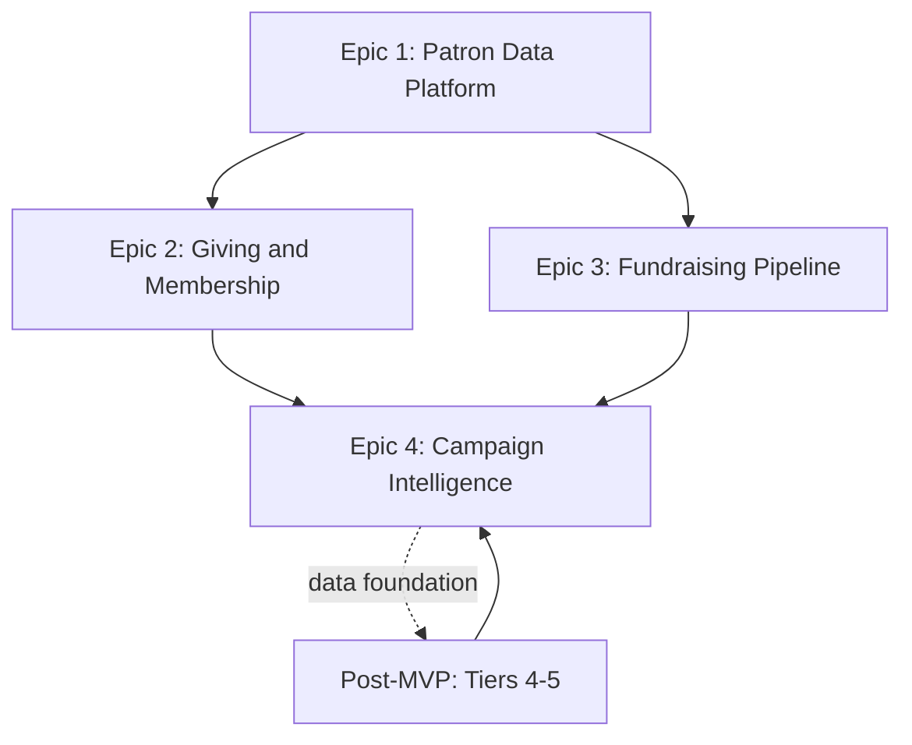

# Fever Zone Fundraising -- Product Roadmap

**Author**: Andres Clavel, Product Manager
**Date**: February 8, 2026
**Status**: Planning
**Audience**: Product stakeholders, executive sponsors

> This is the **strategic product roadmap** -- what we build and in what order. For engineering delivery details (squad composition, timelines, parallelization), see [MVP_ROADMAP.md](MVP_ROADMAP.md).

---

## Product Vision

Transform Fever from a ticketing platform into a **Museum Relationship Platform** by layering donor management onto Fever's existing behavioral data (tickets, attendance, engagement). The result: a unified 360-degree patron view that no standalone CRM can match.

---

## Feature Priority Ranking

### Tier 1: Foundation (Must Have First)

| Priority | Feature | Rationale |
|----------|---------|-----------|
| **1** | **Unified Patron Profile (360-degree View)** | Everything else depends on this. The core value prop and the foundation for all other features. Without a consolidated patron record, nothing else works. |
| **2** | **Household & Relationship Mapping** | Donors exist in families. Householding gifts, navigating between family profiles, and linking beneficiaries to memberships are daily workflows for gift officers. This is foundational, not a nice-to-have. |
| **3** | **Engagement Scoring & Activity Timeline** | Fever's competitive advantage is behavioral data. Engagement heatmaps, visit tracking, and chronological activity logs turn raw ticketing data into actionable cultivation signals. |

### Tier 2: Revenue Enablers (Critical for Sales)

| Priority | Feature | Rationale |
|----------|---------|-----------|
| **4** | **Giving & Membership Management** | Museums need to track every financial relationship: gifts, pledges, recurring donations, and memberships with beneficiary management. Without gift recording with DCAP attribution (Fund/Campaign/Appeal), they cannot report to their boards. |
| **5** | **Tax Documentation (FMV)** | Legal requirement for US nonprofits. Proper tax receipts with deductibility calculations, year-end summaries, and document history. |
| **6** | **Opportunity-Based Moves Management** | The differentiator for major gift cultivation. A structured pipeline (Identification through Stewardship) with opportunity tracking, close-as-won workflow, and contact logging. Without this, Fever is just ticketing + membership, not a CRM. |

### Tier 3: Management & Reporting

| Priority | Feature | Rationale |
|----------|---------|-----------|
| **7** | **Campaign Intelligence & Dashboard** | Development directors need to monitor team performance, campaign health, pipeline velocity, and appeal ROI. This is the management reporting layer that aggregates data from giving and pipeline. |
| **8** | **Alert System** | Automated surfacing of overdue pledge payments, pending acknowledgments, stale follow-ups, and at-risk memberships. Keeps nothing falling through the cracks. |

### Tier 4: Scale & Efficiency (Post-MVP)

| Priority | Feature | Rationale |
|----------|---------|-----------|
| **9** | **Prospect Research Integration** | Wealth screening (DonorSearch/iWave) helps identify *who* to cultivate. Important, but staff can do manual research initially. Requires paid API contract. |
| **10** | **Custom Reporting (LYBUNT/SYBUNT)** | Museums will demand this eventually, but can use dashboard + CSV export initially. Build when there is enough data and customer demand. |
| **11** | **AI / Smart Tips** | Personalized cultivation recommendations powered by Fever's behavioral data. Impressive in demos but requires LLM integration and mature data. |
| **12** | **Corporate / Organization Patrons** | Separate entity from individual patrons (organizations cannot link to Fever user accounts). Build when targeting larger institutions where corporate giving is 30-50% of revenue. |

### Tier 5: Enterprise (Future)

| Priority | Feature | Rationale |
|----------|---------|-----------|
| **13** | **Grant & Foundation Tracking** | Specialized workflow (deadlines, deliverables, compliance) for NEA/NEH recipients. Distinct from individual giving. |
| **14** | **Event / Gala Table Seating** | Complex niche UI. Fever already handles event management. Only needed if native tools don't cover gala-specific needs. |
| **15** | **Financial / ERP Integration** | GL mapping and QuickBooks/Sage sync. Accounting infrastructure for organizations with dedicated finance teams. |
| **16** | **Email Sending / Communication Tools** | Building email delivery is an entire product. Venues already have Mailchimp, Constant Contact, or Fever's comms. The CRM should *log* communications, not *send* them. |

---

## MVP Scope

The MVP delivers **Priorities 1-8** across four delivery epics:

```
MVP = Patron Profile + Households + Engagement + Giving & Membership
    + Tax Docs + Pipeline + Campaign Dashboards + Alerts
```

This gives museums:
- A unified view of their constituents with behavioral data from Fever
- Household management and relationship tracking
- Complete financial relationship tracking (gifts, pledges, recurring, memberships)
- Tax compliance with FMV calculations
- A structured major gift pipeline
- Campaign performance reporting
- Automated alerts for overdue items

### Fever's Competitive Advantage

Native ticketing and event data flows into the patron profile automatically -- something competitors require expensive integrations to achieve.

### Delivery Structure

The MVP is organized into 4 epics with strategic parallelization. See [MVP_ROADMAP.md](MVP_ROADMAP.md) for full detail on squad composition, timeline estimates, risk factors, and phasing.

```
Epic 1                       Epics 2 + 3 (parallel)          Epic 4
Patron Data Platform    -->  Giving & Membership         -->  Campaign Intelligence
(foundation)                 Fundraising Pipeline              & Dashboard
```

- **Epic 1**: Patron profiles, households, relationships, engagement scoring, tagging, activity timeline, archive/restore, add-to-portfolio workflow
- **Epic 2**: Gift recording (DCAP), pledges, recurring gifts, acknowledgments, membership card + benefits + beneficiaries, upgrade workflow, tax documents
- **Epic 3**: Opportunity pipeline (Kanban + list + detail), close-as-won/lost, contact logging, alert system
- **Epic 4**: Campaign dashboard with goal tracking, appeal ROI, fundraising overview, gift officer filtering, patron statistics

### Dependency Diagram



Epics 2 and 3 depend on Epic 1 but **not on each other**, enabling parallel delivery by splitting the squad.

---

## Post-MVP Roadmap

| Phase | Features | Trigger |
|-------|----------|---------|
| **Scale** | Prospect research (DonorSearch API), custom reporting, LYBUNT/SYBUNT | Customer demand; DonorSearch partnership established |
| **Intelligence** | AI/Smart Tips, automated prospect identification | Data platform mature enough for meaningful recommendations |
| **Enterprise** | Corporate patrons, grant tracking, ERP integration | Moving upmarket to institutions where corporate/foundation giving is 30-50% of revenue |
| **Platform** | Email integration (log, not send), event/gala management, PDF generation | Adjacent product area needs justified by usage patterns |

---

## Success Metrics

| Scope | Key Metrics |
|-------|-------------|
| **Patron Data** | Patron records created, data completeness, Fever-linked vs. manual ratio |
| **Giving & Membership** | Donation volume, membership renewal rate, acknowledgment turnaround |
| **Pipeline** | Pipeline value, opportunity close rate, average days per stage |
| **Campaigns** | Campaign goal achievement, appeal ROI, donor retention rate |
| **Post-MVP** | Prospect identification accuracy, report adoption, integration usage |

---

## Related Documents

| Document | Purpose |
|----------|---------|
| [MVP_ROADMAP.md](MVP_ROADMAP.md) | Engineering delivery plan: squad, timelines, risks, phasing |
| [PRODUCT_SPECS.md](PRODUCT_SPECS.md) | Feature specifications, UI component details, design decisions |
| [DATA_MODEL.md](DATA_MODEL.md) | Entity relationships, field definitions, terminology reference |
| [MEMBERSHIP_MODEL_SPEC.md](MEMBERSHIP_MODEL_SPEC.md) | Membership/beneficiary data model and workflow specs |
| [DEMO_WALKTHROUGH.md](DEMO_WALKTHROUGH.md) | 25-minute demo script with wow moments and recovery tips |

---

*Product Manager: Andres Clavel*
*Designer: Pablo Rubio Retolaza*
*Tech Lead: Victor Almaraz Sanchez*
*Last Updated: February 8, 2026*
