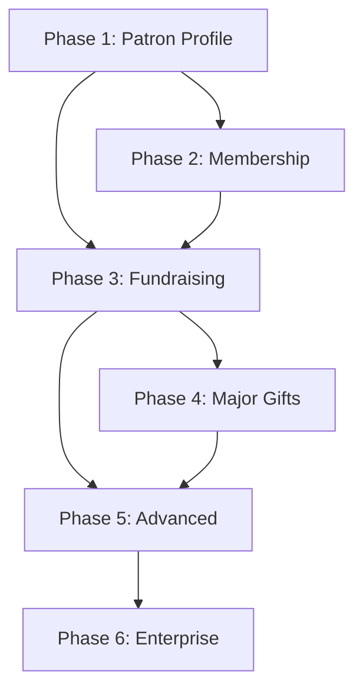

# Fever Zone - Product Roadmap

## Feature Priority Ranking

### Tier 1: Foundation (Must Have First)

| Priority | Feature | Rationale |
|----------|---------|-----------|
| **1** | **Unified Patron Profile (360° View)** | Everything else depends on this. It's the core value prop and the foundation for all other features. Without a consolidated patron record, nothing else works. |
| **2** | **Membership Management** | Fever already does ticketing. Membership is the natural extension and the "top of the funnel" for donor cultivation. This is likely the lowest-friction entry point with museums. |

### Tier 2: Revenue Enablers (Critical for Sales)

| Priority | Feature | Rationale |
|----------|---------|-----------|
| **3** | **Campaign Management (DCAP)** | Museums need to track *where* money goes. Without Fund/Campaign/Appeal attribution, they can't report to their boards. This is often a deal-breaker in sales. |
| **4** | **Tax Documentation (FMV)** | Legal requirement for US nonprofits. If Fever can't generate proper tax receipts with deductibility calculations, museums can't use it for donations. |
| **5** | **Opportunity-Based Moves Management** | The differentiator for major gift cultivation. This is where high-value donors are cultivated. Without it, Fever is just a ticketing + membership system, not a full CRM. |

### Tier 3: Scale & Efficiency

| Priority | Feature | Rationale |
|----------|---------|-----------|
| **6** | **Prospect Research Integration** | Wealth screening (DonorSearch) helps identify *who* to cultivate. Important, but staff can do manual research initially. API integration can wait. |
| **7** | **Household Mapping** | Essential for "householding" donations and membership benefits. Not urgent for initial sales, but needed for mature implementations. |
| **8** | **Custom Reporting** | Museums will demand this eventually, but can use data exports initially. Build once there's enough data to report on. |

### Tier 4: Nice to Have

| Priority | Feature | Rationale |
|----------|---------|-----------|
| **9** | **Event/Gala Management** | Fever already has event capabilities. Table seating is niche. Can be added later as an upsell. |
| **10** | **Grant Tracking** | Important for some museums, but a distinct workflow. Can be a separate module later. |
| **11** | **Financial Integration (ERP)** | Accounting departments will want this, but it's complex (QuickBooks, Sage, etc.). Can be deferred with manual exports. |

---

## Recommended MVP Scope

For an initial sellable product, target **Priorities 1-5**:

```
MVP = Patron Profile + Membership + Campaigns + Tax Docs + Opportunities
```

This gives museums:
- A unified view of their constituents
- Membership management (their bread and butter)
- Donation tracking with proper attribution
- Tax compliance
- Major gift pipeline

### Fever's Competitive Advantage

Native ticketing data flows into the patron profile automatically—something competitors can't match without integrations.

---

## Delivery Phases

### Phase 1: Core Platform
- Unified Patron Profile with 360° view
- Patron list with search and filtering
- Basic contact and engagement data

### Phase 2: Membership Module
- Membership card and benefits display
- Tier management and upgrades
- Renewal tracking and reminders
- Payment link workflow

### Phase 3: Fundraising Foundation
- Campaign Management with DCAP hierarchy
- Donation recording with attribution
- Tax documentation and FMV calculations
- Year-end summary generation

### Phase 4: Major Gift Pipeline
- Opportunity-based architecture
- Moves Management Kanban board
- OpportunitiesList and OpportunityDetail pages
- Close as Won/Lost workflow

### Phase 5: Advanced Features
- Prospect research integration (DonorSearch API)
- Full household/relationship mapping
- Custom reporting and dashboards
- Event/gala management enhancements

### Phase 6: Enterprise
- Grant tracking module
- Financial/ERP integrations
- Advanced automation and workflows

---

## Success Metrics by Phase

| Phase | Key Metrics |
|-------|-------------|
| Phase 1 | Patron records created, data completeness |
| Phase 2 | Membership conversions, renewal rate |
| Phase 3 | Donation volume, campaign goal achievement |
| Phase 4 | Pipeline value, opportunity close rate |
| Phase 5 | Prospect identification accuracy, household coverage |
| Phase 6 | Integration adoption, grant success rate |

---

## Dependencies



---

*Last Updated: February 6, 2026*
