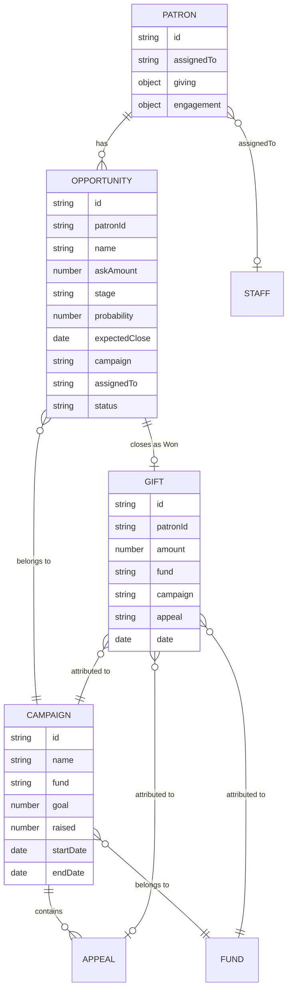
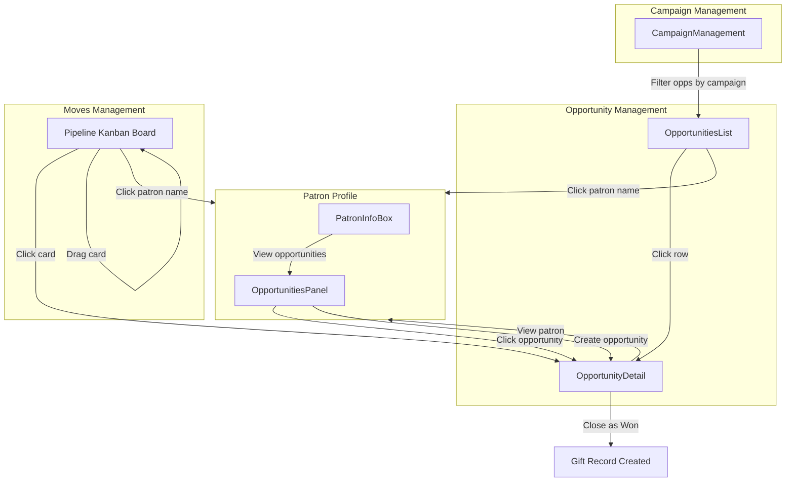

# Fever Zone - Patron Profile Product Specifications

## Product Overview

### What is Fever Zone?
Fever Zone is Fever's **back-office interface** for museum and cultural institution partners. While Fever started as a ticketing platform, it is evolving into a **Museum Relationship Platform** that helps institutions manage not just admissions, but the entire patron lifecycle from visitor to member to major donor.

### What is a Patron?
A **Patron** is any individual or entity (household, corporation) that has a relationship with a museum. This includes:
- Visitors and ticket buyers
- Members (various tiers)
- Donors (one-time or recurring)
- Major donors and planned giving donors
- Board members
- Volunteers
- Corporate sponsors
- Event attendees
- Prospects

This concept is also known as a "**Constituent**" in competitor platforms like Tessitura and Bloomerang.

---

## The Problem

### Fragmented Data Landscape
Museums today face critical challenges:

1. **Data Silos**: Patron information is spread across multiple platforms:
   - Ticketing system
   - Donor CRM
   - Email marketing platform
   - On-site POS systems
   - Membership management

2. **Limited Engagement Visibility**: Existing systems track donations but miss critical engagement signals like:
   - Attendance frequency
   - Purchase history
   - Digital interactions
   - Communication responses

3. **Operational Inefficiency**: Teams waste significant time:
   - Manually reconciling data between systems
   - Creating reports from multiple sources
   - Tracking patron interactions in spreadsheets

4. **Weak Personalization**: Without unified data:
   - Communications are generic
   - Cultivation efforts are not data-driven
   - Conversion and retention rates suffer

### Business Impact
- The lack of a holistic patron view is a **major blocker in sales deals** with US museums
- Museums either require integration with their existing systems OR a demonstration of Fever's own unified solution
- Competitors (Tessitura, Raiser's Edge, Bloomerang) have established donor dashboards

---

## The Solution: Unified Patron Profile

### Vision
Transform Fever from a ticketing platform into a **Museum Relationship Platform** by providing a **360° Patron View** that consolidates all interactions into a single, intuitive profile.

### Key Value Propositions

1. **360° Patron View**: Consolidate all interactions (tickets, visits, donations, communications) into one profile
2. **Data-driven Cultivation**: Provide engagement insights and lifetime value metrics to guide donor stewardship
3. **Operational Streamlining**: Eliminate data silos and manual imports between systems
4. **Competitive Differentiation**: Modern, integrated, museum-tailored alternative to legacy systems

---

## Fundraising Entity Model

This section documents how the core fundraising entities relate to each other. Understanding these relationships is critical for the system architecture.

### Entity Relationships



### Patron and Opportunity

- A patron can have 0, 1, or many opportunities (one-to-many relationship)
- Opportunities are linked to patrons via the `patronId` field
- Having opportunities does NOT make someone a Managed Prospect (only `assignedTo` does)
- A General Constituent could theoretically have opportunities if assigned to a portfolio later
- The patron profile's **OpportunitiesPanel** displays all opportunities for that patron
- The patron header shows an opportunity summary: "2 active opportunities · $60K pipeline"

### Opportunity and Pipeline (Moves Management)

- The Pipeline Kanban board displays **Opportunities**, not Patrons
- Each column represents a pipeline stage: Identification → Qualification → Cultivation → Solicitation → Stewardship
- Dragging a card between columns changes the opportunity's `stage` field
- Only opportunities with `status: 'open'` appear on the board
- When closed (Won/Lost), opportunity is removed from active pipeline
- Multiple opportunities from the same patron can appear on the board simultaneously
- Filter by: Assignee, Campaign, Stage

### Opportunity and Campaign

- Each opportunity has a `campaign` field linking it to a fundraising campaign
- This connects the "ask" to the strategic fundraising goal
- Examples: "2026 Annual Fund", "Building the Future Capital Campaign"
- The OpportunitiesList page can filter by campaign
- The Pipeline (MovesManagement) can filter by campaign
- When opportunity closes as "Won", the resulting gift inherits the campaign attribution

### Campaign and DCAP Hierarchy

Campaigns exist within the DCAP (Designation/Fund → Campaign → Appeal → Package) hierarchy:

- **Fund**: The accounting destination (Annual Operating, Capital Building, Education, Endowment)
- **Campaign**: The strategic multi-year goal (2026 Annual Fund, Building the Future)
- **Appeal**: The marketing trigger (Spring Gala, Year-End Mailer)
- **Package**: The specific variant for A/B testing (optional)

Opportunities are linked at the Campaign level. Gifts record full attribution (Fund + Campaign + Appeal).

### Opportunity to Gift Lifecycle

**When an opportunity is "Closed as Won":**
- A new Gift record is created
- Gift amount = opportunity's askAmount (or actual amount received)
- Gift inherits: patronId, campaign, fund, assignedTo (as soft credit)
- Opportunity status changes to `closed-won`

**When an opportunity is "Closed as Lost":**
- No gift record created
- Opportunity status changes to `closed-lost`
- Record preserved for historical analysis (why did they say no?)

### Patron and Campaign (via Gifts)

- Patrons don't directly belong to campaigns
- The relationship is through completed gifts
- GivingSummary shows patron's campaign breakdown
- A patron may contribute to multiple campaigns over time

### Navigation Flow



### Key Architectural Decisions

**1. Why opportunities, not patrons, on the pipeline?**
- A single donor may be cultivated for multiple asks simultaneously (Gala sponsorship + Annual Fund gift)
- Pipeline reporting needs dollar values and expected close dates per "deal"
- Industry standard (Salesforce, Raiser's Edge) uses this model

**2. Why separate patron `assignedTo` from opportunity assignment?**
- Patron ownership (portfolio assignment) is persistent
- Opportunity assignment can differ (different staff for different campaigns)
- A patron remains "managed" even if all their opportunities close

**3. Why link opportunities to campaigns?**
- Enables pipeline reporting by campaign ("$2M in solicitation for Annual Fund")
- Connects cultivation efforts to strategic goals
- Ensures gift attribution when opportunity closes

---

## Target Users

### Primary Users
1. **Development (Fundraising) Teams**
   - Responsible for donor cultivation and stewardship
   - Need to identify high-potential prospects
   - Track giving history and engagement signals

2. **Marketing Teams**
   - Manage patron communications
   - Segment audiences for targeted campaigns
   - Track engagement and conversion

### Secondary Users
- Executive leadership (reporting and insights)
- Operations teams (data management)
- Customer service representatives

### User Context

**Important**: Fever Zone is exclusively a **partner-facing interface**. Patrons (members, donors, visitors) do not access Fever Zone directly.

- **Primary Interface Users**: Partner employees (museum staff, box office, membership desk, development team)
- **NOT for Patrons**: Patrons interact with Fever through consumer-facing apps and websites, not Fever Zone
- **Implication for Features**: 
  - Membership upgrades require **payment links** sent to patrons (not direct checkout)
  - Actions are performed "on behalf of" patrons by staff
  - POS interfaces exist separately for in-person transactions

---

## Feature Overview

### Patron Profile Components

#### 1. Patron Header / Info Box
- **Profile Photo**: Visual identification
- **Name**: Primary patron name
- **Household/Family**: Link to related patrons
- **Tags**: Patron category (Member, Donor, etc.)
- **Contact Info**: Email (primary starred), phone, address
- **Membership Status**: Programme, tier, member since, renewal countdown
- **Quick Actions**: Dropdown for common tasks

#### 2. Tab Navigation
- **Summary**: Dashboard view of all key metrics
- **Memberships**: Detailed membership management (see detailed spec below)
- **Profile**: Editable contact information and preferences
- **Timeline**: Complete chronological activity log
- **Relationships**: Family/household/corporate connections
- **Documents**: Tax documentation and receipts (see detailed spec below)

#### 2a. Memberships Tab (Detailed Specification)

The Memberships tab provides comprehensive membership management for partners. It consists of a two-column layout:

**Left Column Components:**

##### Membership Overview
The primary component showing the patron's membership status:

- **Membership Card**
  - CR80 standard aspect ratio (1.586:1, matching physical card dimensions)
  - Dynamic background color based on membership tier configuration
  - QR code for scanning at venue (encodes `patronId-membershipId`)
  - Tenure badge (e.g., "2-YEAR MEMBER") for members with 1+ years
  - Patron name, ID, and validity date
  - Active/Inactive status indicator

- **Key Stats Panel**
  - Current period with period type (yearly/monthly)
  - Days to renewal with urgency warning (highlighted if ≤14 days)
  - Membership price
  - Auto-renewal status (ON/OFF badge)
  - Payment method on file (card type + last 4 digits)

- **Benefits Display** (Two-Section Approach)
  
  The benefits display is split into two distinct sections for clarity:
  
  **Section 1: "Your Benefits" (Categorized)**
  - Benefits grouped by category (from PRD: Membership Perks Management)
  - Three categories:
    - **Access**: EntryPass to venues, unlimited visits, priority entry
    - **Discounts**: F&B discounts, event discounts, guest/friend tickets
    - **Complimentary**: Welcome packs, parking, coat check
  - Clean list showing icon, title, and description only
  - No usage data in this section (keeps it scannable)
  
  **Section 2: "Usage This Period"**
  - Only shows benefits with trackable consumption
  - Progress bars for limited benefits (e.g., "3/5 guest passes")
  - Count display for unlimited benefits (e.g., "used 34x")
  - Reset dates where applicable
  - Visual distinction for exhausted benefits ("Used up")

- **Upgrade CTA** (if eligible)
  - Secondary-style button below the card
  - Opens upgrade modal (see Upgrade Flow section)

##### Early Access Events
Shows upcoming events where members get early ticket access:
- Event name, date, and thumbnail image
- Member access date vs public access date
- Status badges: "Early access in X days", "Member access open", "Public sale live"
- Timeline visualization of access windows

##### Redemption History
Chronological log of perk usage with savings tracking:
- Perk name and icon
- Location where redeemed
- Date of redemption
- Savings amount per redemption
- Total savings summary in header
- "View full history" link for extended log

##### Membership Documentation
Access to membership-related documents:
- Terms & Conditions
- Membership receipts
- Renewal invoices

**Right Column Components:**

##### Membership Actions
Quick action links for common membership operations:
- Renew membership
- Modify membership
- Cancel membership
- Resend confirmation email
- Assign beneficiaries (future feature)

#### 2b. Membership Upgrade Flow

Since Fever Zone is partner-facing (not patron-facing), membership upgrades use a **payment link workflow** rather than direct checkout.

**Flow Overview:**
```
Partner clicks "Upgrade" → Modal opens → Partner copies/emails payment link → Patron receives link → Patron completes payment
```

**Upgrade Modal Components:**

1. **Header**
   - Title: "Upgrade your membership"
   - Tier transition badges: [Current Tier] → [Upgrade Tier]
   - Close button

2. **Enhanced Features Section**
   - Side-by-side comparison of current vs upgrade values
   - Example: "Guest passes: 5/year → Unlimited"
   - Strikethrough styling on current values

3. **New Benefits Section**
   - List of benefits only available in upgrade tier
   - Checkmark icons for each new benefit

4. **Price Summary**
   - Upgrade tier price (e.g., "$249.99/year")
   - Additional cost calculation (upgrade price - current price)

5. **Payment Link Section**
   - Generated URL: `https://pay.fever.co/upgrade/{patronId}/{tier}`
   - Read-only input field displaying the link
   - "Copy" button with "Copied!" feedback state

6. **Actions**
   - "Close" (secondary button)
   - "Send Payment Link via Email" (primary button)

**Email Template (auto-generated):**
- **To**: Patron's email address
- **Subject**: "Upgrade your membership to [Tier]"
- **Body**:
  - Personalized greeting with patron name
  - Current tier → Upgrade tier explanation
  - Bullet list of new benefits
  - Price information
  - Payment link
  - Contact information for questions

#### 2c. Documents Tab (Detailed Specification)

The Documents tab provides centralized access to tax documentation for both membership payments and donations. This follows Bloomerang's pattern for year-end tax documentation.

**Key Features:**

##### Year-End Tax Summary (Primary Feature)
Generate and send consolidated tax summaries to patrons for any calendar year.

- **Year Selector**: Dropdown to select the tax year (default: previous calendar year)
- **Preview Panel**: Shows the complete tax summary document including:
  - Organization info (name, EIN, address)
  - Patron name and address
  - Itemized contributions table with:
    - Date, description, amount, tax-deductible amount
    - Type badges (Membership vs Donation)
  - Total amounts
  - Legal disclaimer about 501(c)(3) status
- **Actions**:
  - "Copy Link" - Copy patron portal link for self-service access
  - "Download PDF" - Generate PDF for mailing
  - "Send via Email" - Primary action to email the summary to patron

**Deductibility Rules:**
- Donations: Fully tax-deductible
- Membership payments: Partially deductible (payment minus fair market value of benefits received)

##### Document History
Chronological log of all documents generated for this patron.

- Document type (Tax Summary, Receipt)
- Year/Period covered
- Date generated
- Sent status (Sent / Not sent)
- Actions: View, Download, Resend

##### Individual Receipts
Per-transaction receipt access with filtering.

- Date range filter
- Type filter (Membership, Donation, In-Kind)
- Receipt details: Date, type, description, amount, deductible amount
- Download individual receipts

##### In-Kind Donations (If Applicable)
Separate section for non-monetary gifts.

- Note banner explaining that donors assign fair market value
- List of in-kind gifts with descriptions and acknowledgement status

**Workflow (Partner-Facing):**
```
Partner opens Documents tab → Selects year → Generates/Previews summary → Sends via email OR downloads PDF for mailing → Patron receives documentation
```

**Sample Tax Document Data:**
| Field | Value |
|-------|-------|
| Organization | Fonck Museum |
| EIN | 12-3456789 |
| 2025 Contributions | $9,095.99 total (8 gifts) |
| 2025 Deductible | $8,645.99 |

#### 3. Giving Summary (Financial Summary)
- **Lifetime Contributions**: Total giving with breakdown (donations vs. revenue)
- **Average Contribution**: Mean gift size
- **Hybrid Chart**: Toggle between two visualization modes:
  - **Cumulative View**: Stacked area chart showing growth over time
  - **Nominal View**: Bar chart showing individual period amounts
- **Time Filters**: 1 year, 5 years, YTD, All time
- **Transaction Highlights**:
  - First transaction (date and amount)
  - Last transaction (date and amount)
  - Largest transaction (date and amount)
- **Gift Attribution**: Breakdown by Fund, Campaign, and Year
- **Record Gift**: Button to manually record a new gift

#### 4. Engagement Module
- **Engagement Level**: Visual indicator with 5 levels:
  - Cold (snowflake icon)
  - Cool (meh face)
  - Warm (smile)
  - Hot (laugh)
  - On Fire (fire icon)
- **Engagement Badge**: Tooltip on hover explaining the level
- **Attendance Tracking**: Total visits and last visit date
- **Activity Heatmap**: 12-month × 4-week grid showing engagement intensity
  - Color intensity indicates activity level (lighter = less, darker = more)
  - TTM (Trailing Twelve Months) toggle to switch view
  - Helps visualize seasonal patterns and engagement consistency
- **Manual Override**: Staff can adjust engagement level

#### 5. Wealth Insights (Post-MVP)
- **Integration**: DonorSearch third-party service
- **Propensity to Give Score**: Financial capacity indicator
- **Wealth Screening Data**: Estimated net worth, real estate, etc.

#### 6. Fever Insights / Smart Tips (Post-MVP)
- **AI Summary**: Natural language summary of patron activity
- **Actionable Recommendations**:
  - "Offer membership" (frequent visitors)
  - "Renew membership" (approaching expiration)
  - "Send invitation" (upcoming relevant events)
  - "Donation capacity" (high-capacity, low-giving patrons)
- **Quick Actions**: Direct links to take recommended actions

#### 7. Recent Activity / Timeline
- **Activity Types**:
  - Communication: Phone calls, emails, messaging, meetings
  - Earned Revenue: Ticket purchases, transfers, reschedules, upgrades, retail, F&B
  - Contributed Revenue: Donations, membership purchases/renewals
  - Engagement: Event attendance, reviews, notes
- **Manual Logging**: Staff can add external interactions
- **Expandable Details**: Click to see full activity context

#### 8. Relationships
- **Household Members**: Spouse, children, head of household status
- **Corporate Connections**: Employer, board positions (Phase 3)
- **Shared Benefits**: Membership sharing within households

---

## Patron Management Model: The Two-Speed System

### Overview

A critical distinction in museum fundraising software is between patrons who are **actively managed** through individual relationship cultivation versus those who are **handled at scale** through automated campaigns. This "two-speed system" reflects how development teams actually operate.

### The Donor Pyramid

In a typical mid-to-large museum database:

| Segment | % of Database | Description | Management Style |
|---------|---------------|-------------|------------------|
| **General Constituents** | ~90% | One-time ticket buyers, small donors, basic members | Automated (campaigns, appeals, email blasts) |
| **Mid-Level Donors** | ~8% | $500–$2,500 donors | Semi-automated workflows |
| **Managed Prospects** | ~2% | High-capacity individuals ($10,000+ potential) | Individual relationship management |

### Terminology

**General Constituent**
- Any patron in the database who is NOT being actively cultivated
- No assigned relationship manager (`assignedTo` field is empty)
- Interactions are transactional (buy a ticket, renew membership)
- Handled through mass communications and automated workflows
- May have 0 opportunities

**Managed Prospect**
- A patron with an assigned relationship manager (`assignedTo` field populated)
- In someone's portfolio for active cultivation
- May have 0, 1, or many **Opportunities** (see Fundraising Entity Model)
- Requires high-touch, manual relationship building

**Important**: The distinction is based solely on whether the patron has an `assignedTo` value. Pipeline stages are tracked on **Opportunities**, not on the patron record itself.

### Why This Distinction Matters

1. **Staff Accountability**: Major Gift Officers are evaluated on their "portfolio" of managed prospects. If the system mixes in 50,000 general constituents, accountability is lost.

2. **Interface Performance**: The Moves Management Kanban board displays Opportunities from managed prospects. Only the ~2% of patrons who are actively managed will have opportunities on the board.

3. **Data Sensitivity**: Managed Prospects often have wealth screening data, relationship notes, and cultivation strategies that should have restricted access.

4. **Feature Relevance**: Opportunity-specific features (ask amount, expected close, probability) only appear for Managed Prospects.

### Implementation in UI

The Patron Profile adapts based on patron type:

| Feature | General Constituent | Managed Prospect |
|---------|---------------------|------------------|
| **Header Info** | Basic contact info | Shows "Assigned to [Name]" + opportunity summary |
| **Sidebar Panel** | "Add to Portfolio" prompt | OpportunitiesPanel with active opportunities |
| **Actions Dropdown** | Standard actions | Includes "Create Opportunity" |
| **Smart Tips** | General recommendations | Cultivation-focused tips |
| **Opportunity Summary** | Not shown | "2 active opportunities · $60K pipeline" |

### "Promote to Prospect" Workflow

The system should support promoting a General Constituent to a Managed Prospect:

**Manual Promotion:**
- Staff identifies high-potential donor
- Clicks "Add to Portfolio" on their profile
- Assigns to a Gift Officer (sets `assignedTo`)
- Optionally creates their first Opportunity

**Automated Alerts (Future):**
- When lifetime giving crosses threshold (e.g., $5,000)
- When wealth screening flags high capacity
- System notifies Development Director: "New prospect identified—assign to portfolio?"

### Data Model

**Patron Records** (`src/data/patrons.js`):

```javascript
// General Constituent (no assignedTo)
{
  id: 'paul-fairfax',
  firstName: 'Paul',
  lastName: 'Fairfax',
  // NO assignedTo field - not in anyone's portfolio
  engagement: { ... },
  giving: { ... }
}

// Managed Prospect (has assignedTo)
{
  id: 'anderson-collingwood',
  firstName: 'Anderson',
  lastName: 'Collingwood',
  assignedTo: 'Liam Johnson',  // Relationship manager - makes this a Managed Prospect
  // NOTE: No prospect object - pipeline data is on Opportunities
  engagement: { ... },
  giving: { ... }
}
```

**Opportunity Records** (`src/data/opportunities.js`):

```javascript
// Opportunities are separate entities linked to patrons
{
  id: 'opp-1',
  patronId: 'anderson-collingwood',
  patronName: 'Anderson Collingwood',
  name: 'Annual Fund Major Gift',
  askAmount: 25000,
  stage: 'cultivation',        // Pipeline stage lives HERE
  probability: 60,
  expectedClose: '2026-03-15',
  nextAction: 'Follow up re: gallery tour',
  lastContact: '2026-01-15',
  campaign: '2026 Annual Fund',
  assignedTo: 'Liam Johnson',
  status: 'open'               // open, closed-won, closed-lost
}
```

### Helper Function

```javascript
// Determine if patron is actively managed
// A managed prospect simply has an assignedTo (relationship manager)
const isManagedProspect = (patron) => Boolean(patron?.assignedTo)
```

---

## Patron Tagging System

### Overview
Patrons are segmented using a **3-tier tagging system**: manual system tags, computed tags (auto-derived from data), and custom tags. This replaces the previous approach where giving-status tags like "Donor" were manually assigned.

### Tag Tiers

**1. Manual System Tags** (predefined, manually assigned, cannot be deleted):
- Prospect
- Board Member
- Volunteer
- Corporate
- Foundation
- Planned Giving
- VIP
- Subscriber

**2. Computed Tags** (auto-derived from patron data, configurable thresholds):
- **Donor** — Automatically applied when `giving.totalGifts > 0`. Threshold is fixed.
- **Major Donor** — Automatically applied when `giving.totalGifts >= $10,000`. Threshold is configurable in Settings.
- **Lapsed Donor** — Automatically applied when a Donor has no gift in the last 18 months. Window is configurable in Settings.

Computed tags cannot be manually added or removed from a patron. They appear and disappear automatically as patron data changes.

**3. Custom Tags**: Users can create additional tags for organization-specific segmentation (e.g., "Gala 2026 Prospect", "Museum Circle").

### Tag Display

**Effective Tags**: Everywhere tags are displayed, the system shows `getEffectiveTags(patron)` which merges manual tags + computed tags (deduplicated).

**In Patron Profile (PatronInfoBox):**
- Shows first tag + clickable "+N" indicator for additional tags
- Clicking the indicator opens a **popover** with:
  - Full list of assigned tags — computed tags show a bolt icon and are **not removable**
  - Manual tags show an X button for removal
  - Search/add input with autocomplete (only suggests manual tags)
  - Option to create new custom tags

**In Patrons List:**
- Shows up to 2 tags with "+N more" overflow indicator
- Hover tooltip shows full tag list
- Filter panel includes all 3 tiers (system + computed + custom)

### Tag Management (Settings Page)
The **Fundraising > Settings** page provides global tag configuration in 3 groups:

**System Tags group:**
- View predefined tags with usage counts
- Edit tag labels (inline editing)
- Cannot be deleted

**Computed Tags group:**
- View auto-derived tags with live patron counts
- "Computed" badge distinguishes from system tags
- Edit thresholds inline for configurable rules (Major Donor amount, Lapsed Donor months)
- Rule description shows current criteria (e.g., "Lifetime gifts >= $10,000")
- Cannot be deleted or renamed

**Custom Tags group:**
- Create, edit, delete user-defined tags
- Usage count and delete confirmation when in use

### Data Model
```javascript
// Patron record — only stores MANUAL tags
{
  tags: ['board-member'],  // Array of manual tag IDs only
  // ...other fields
}

// Manual tag definition (src/data/patrons.js)
{
  id: 'board-member',
  label: 'Board Member',
  system: true  // false for custom tags
}

// Computed tag rule (src/data/patrons.js)
{
  id: 'major-donor',
  label: 'Major Donor',
  description: 'Lifetime gift total meets or exceeds threshold',
  field: 'giving.totalGifts',
  operator: '>=',
  threshold: 10000,  // configurable in Settings
  editable: true,
}

// getEffectiveTags(patron) → merges manual tags + computed tags for display
```

---

## Patron Source Indicators

### Overview
The system tracks how patrons entered the database, displaying visual indicators to distinguish between automatically-created and manually-added patrons.

### Source Types

| Source | Icon | Description |
|--------|------|-------------|
| **Fever** | Fever logo dot | Patron created automatically via Fever transaction (ticket purchase, online order) |
| **Manual** | Edit icon dot | Patron added manually by staff |

### Display
- **Patrons List**: Small indicator dot before patron name
- **"New" Badge**: Blue badge shown for patrons added within last 7 days

### Data Model
```javascript
{
  source: 'ticket',     // Options: ticket, online, membership, manual, import
  createdDate: '2026-02-04T10:30:00Z'
}
```

---

## Patron Archive (Soft Delete)

### Overview
Rather than permanently deleting patrons, the system uses a **soft delete** approach via archiving. This preserves data integrity while hiding inactive patrons from normal workflows.

### Archiving
- **Action**: Click "Archive" in patron actions dropdown
- **Confirmation**: Warning dialog explains the patron will be hidden
- **Result**: Patron status set to `archived`, hidden from main Patrons List

### Restoring
- **View Archived**: Toggle "Show Archived" filter in Patrons List
- **Visual**: Archived patrons show a gray "Archived" badge
- **Action**: Click "Restore" in actions dropdown or archived banner
- **Result**: Patron status restored to `active`

### Data Model
```javascript
{
  status: 'archived',           // 'active' | 'archived'
  archivedDate: '2026-02-05T...',
  archivedReason: 'duplicate'   // optional
}
```

---

## Gift vs Donation Terminology

### The Principle

The platform maintains a deliberate split between **partner-facing** and **customer-facing** terminology:

- **Partner-facing (staff CRM)**: Use **"Gift"** and **"Giving"**. This is the language fundraising professionals use internally. It appears in data model fields, staff UI labels, API names, and database columns.
- **Customer-facing (patron-facing)**: Use **"Donation"** and **"Donate"**. This is the language patrons understand. It appears in public-facing pages, prompts, and any interface that patrons interact with directly.

### Where Each Term Applies

| Context | Term Used | Examples |
|---------|-----------|----------|
| Database / Internal | Gift, Giving | `totalGifts`, `lastGift`, `GIFT` entity, `PATRON_GIVING` |
| Staff UI (CRM screens) | Gift, Giving | "Record Gift", "Gift History", "Giving Summary", "Giving Tab" |
| Sidebar navigation (customer-facing features) | Donation | "Donation Prompts", "Donation Pages" |
| Public-facing interfaces | Donation, Donate | "Make a Donation" buttons, donation forms, donation confirmation emails |
| Tax Documents | Contribution, Gift | Year-end tax summaries, receipts |

### Why Sidebar Says "Donation Prompts" and "Donation Pages"

These sidebar items refer to features that produce **customer-facing content** -- the prompts and pages that patrons see when they donate. Because patrons interact with them directly, they use "Donation" (the customer-facing term), not "Giving" (the partner-facing term).

### Industry Rationale
- **Professional**: "Gift" is industry-standard for donor CRM software (Blackbaud, Tessitura, Bloomerang)
- **Relational**: Implies personal, philanthropic relationship vs. transactional "donation"
- **Legal**: Aligns with IRS terminology for tax-deductible contributions
- **Patron clarity**: "Donation" is more widely understood by the general public than "Gift" in a philanthropic context

---

## Patron Categories

### Philanthropic Supporters
- Donor
- Major Donor
- Planned Giving Donor

### Institutional Funders
- Corporate Sponsor
- Foundation

### Participants and Members
- Member
- Lapsed Member
- Event Attendee
- Prospect

### Internal Roles
- Board Member
- Volunteer
- Staff

---

## Patron Statuses
- Active
- Archived
- Inactive
- Pending
- Prospect

---

## Engagement Levels

| Level | Icon | Description |
|-------|------|-------------|
| Cold | Snowflake | No recent engagement |
| Cool | Meh face | Minimal engagement |
| Warm | Smile | Moderate engagement |
| Hot | Laugh | Strong engagement |
| On Fire | Fire | Highly engaged, ready for cultivation |

---

## MVP Delivery Epics

The MVP is structured as four sequential epics. Each epic is independently demoable and builds on the previous one. Together they deliver a complete fundraising CRM that enriches Fever's ticketing data with donor management capabilities for individual patrons.

### Epic 1: Patron Data Platform

The foundation. A searchable, filterable database of patrons enriched with Fever ticketing data. Delivers the core value proposition: "See everything about a patron in one place."

**Primary user**: Gift officer, development coordinator

**Features:**
- Patron List page (search, filter, sort, columns, CSV export, archive toggle)
- Patron creation (manual modal + Fever account linking)
- Patron Info Box (photo, contact info, household popover, actions dropdown)
- Patron profile header (breadcrumb, managed prospect vs. general constituent badge)
- Households entity and household member popover with cross-profile navigation
- Relationships summary (household, professional, external contacts)
- Tagging system (3-tier: manual system + computed + custom tags, popover UI for add/remove manual tags, computed tags auto-derived from giving data)
- Archive / restore (soft delete with banner and restore action)
- Engagement panel (level indicator, visit stats, 12-month activity heatmap with TTM toggle)
- Activity Timeline (compact variant on Summary tab, full variant on Timeline tab)
- Settings page (tag management: 3-tier view with computed tag threshold editing, create/edit/delete custom tags, usage counts)
- Add to Portfolio bar (promote general constituent to managed prospect)
- Assign Portfolio modal

### Epic 2: Giving & Membership Management

The financial relationship layer. Tracks all money in (gifts, pledges, recurring) and membership lifecycle. Requires the DCAP hierarchy data model (Fund > Campaign > Appeal) as reference data for gift attribution.

**Primary user**: Gift officer, membership coordinator

**Features:**
- DCAP hierarchy data model (Funds, Campaigns, Appeals as reference data for dropdowns)
- Giving Summary on Summary tab (lifetime value, hybrid chart, fund/campaign attribution, transaction highlights)
- Giving Tab -- dedicated full-width tab with:
  - Pledges panel (total pledged, paid, balance, pledge cards with progress)
  - Recurring panel (monthly equivalent, profile cards with payment method, next date)
  - Gift History table (sortable, paginated, type badges, acknowledgment status)
  - Acknowledgments panel (pending vs. sent, summary stats, send actions)
- Gift recording modal (amount, type, DCAP attribution, soft credits)
- Membership tab:
  - Membership card (CR80 ratio, QR code, tier styling, tenure badge)
  - Key stats (period, renewal countdown, auto-renew status, payment method)
  - Benefits by category (Access, Discounts, Complimentary)
  - Usage tracking (progress bars for limited benefits, counts for unlimited)
- Membership beneficiaries (add/remove with household relationship linking)
- Membership history timeline
- Early access events (member-exclusive access windows with status badges)
- Upgrade modal (tier comparison, email workflow)
- Documents tab (tax summary with preview, document history, in-kind donations)

### Epic 3: Fundraising Pipeline

The active cultivation workflow. How gift officers manage their portfolio of opportunities through the major gift cycle.

**Primary user**: Gift officer, major gifts manager

**Features:**
- Opportunity creation modal (patron, ask amount, stage, campaign, fund, probability)
- Opportunity detail page (full view with pipeline stepper + edit mode)
- Opportunities list page (table view with filters: stage, assignee, campaign)
- Pipeline / Moves Management Kanban (5 stages: Identification > Qualification > Cultivation > Solicitation > Stewardship, HTML5 drag-and-drop, filters by assignee and campaign)
- Close as Won modal (records gift, links to opportunity)
- Close as Lost (with reason tracking)
- Log Contact / Activity modal (creates INTERACTION record: phone, email, meeting, etc.)
- Alert banner on patron profile (overdue pledge payments, pending acknowledgments)
- Opportunities panel on patron profile sidebar (for managed prospects: active opportunities, pipeline value summary, closed opportunities)

### Epic 4: Campaign Intelligence & Dashboard

The management reporting layer. How development directors track strategic fundraising goals and team performance.

**Primary user**: Development director, VP of advancement

**Features:**
- Campaign Management page (card-based grid dashboard)
- Campaign cards (goal progress bar, total raised, donor count, gift count, avg gift, timeline)
- Status grouping (active vs. completed campaigns)
- Filters by status and by fund
- Aggregate totals (total goal, total raised, overall progress across all campaigns)
- Expandable appeals with ROI breakdown (raised vs. cost per appeal)
- Fundraising Dashboard:
  - Quick stats cards (open opportunities, pipeline value, weighted pipeline, managed prospects)
  - Pipeline overview (stage-by-stage breakdown with counts and values)
  - Closing soon (opportunities closing within 30 days)
  - Follow-ups needed (opportunities with no contact in 14+ days)
  - Quick actions (links to Add Patron, New Opportunity, View Campaigns, Pipeline Board)
  - Patron summary (total patrons, managed, general constituent counts)
  - Gift officer filter (filter all dashboard data by assigned relationship manager)

---

## Out of Scope for MVP

The following features are explicitly deferred beyond MVP. For each, a rationale is provided along with guidance on when it becomes necessary.

### Corporate / Organization Patron Profiles

**Decision**: The MVP focuses exclusively on individual patron management.

**Rationale**:
1. **Fever account constraint**: Every patron record has a 1:1 link to a Fever user account, which is inherently an individual person. Fever user accounts generate the behavioral data (ticket purchases, event attendance, engagement history) that powers the patron profile. There is no concept of a "corporate Fever account" -- organizations don't buy tickets or attend events through the Fever app; their employees do, each with their own accounts.
2. **Target market fit**: The primary customers -- performing arts venues, museums, and cultural institutions using Fever for ticketing -- have overwhelmingly individual donor bases. A mid-size venue might have 5-10 corporate sponsors versus hundreds or thousands of individual donors. Corporate sponsorship deals at this tier are typically managed offline by the development director.
3. **Current workaround**: Corporate contacts are represented as individual patrons tagged with `corporate` or `foundation`. Sponsorship opportunities are tracked through that contact person's profile.

**When to build**: When targeting larger institutions (major symphony orchestras, flagship museums, university advancement offices) where corporate and foundation giving represents 30-50% of revenue.

**Future architecture**: Organizations should be a **separate entity** from patrons (not a unified constituent with a `type` field), because organizations cannot link to Fever user accounts and have fundamentally different profile content. An `AFFILIATIONS` join table would link individual patrons to organizations (with role, title, isPrimaryContact).

### Wealth Screening / DonorSearch Integration

**Current state**: Placeholder `WealthInsights` component with static demo data.

**Why defer**: Requires a paid third-party API contract (DonorSearch, iWave, or WealthEngine). Most mid-size venues don't subscribe to these services. The placeholder demonstrates the vision without the integration cost.

**When to build**: When customers request prospect research capabilities or when a DonorSearch partnership is established.

### AI / Smart Tips

**Current state**: `SmartTips` component with hardcoded recommendations.

**Why defer**: Requires LLM integration, prompt engineering, and content guardrails. High engineering effort for a feature that is impressive in demos but not a daily workflow driver.

**When to build**: When the data platform is mature enough to generate meaningful personalized recommendations (sufficient gift history, interaction data, and engagement patterns).

### Import Data Processing

**Current state**: 3-step UI mockup in Settings (source selection, field mapping, preview). No actual data processing.

**Why defer**: Real data migration from Blackbaud/Tessitura exports requires field mapping validation, deduplication, error handling, and rollback capabilities. Every source system's export format is different. This is a *services engagement* (white-glove onboarding), not a self-service product feature for MVP.

**When to build**: When onboarding volume justifies productizing the migration process.

### Financial / ERP Integration

**Why defer**: GL mapping and QuickBooks/Sage Intacct/Blackbaud Financial Edge sync is accounting infrastructure. Venues at the target size often don't have an ERP -- they use QuickBooks or a spreadsheet. This is an enterprise feature.

**When to build**: When targeting organizations with dedicated finance teams that require automated reconciliation.

### Grant & Foundation Tracking

**Why defer**: Grant management (application deadlines, deliverables, compliance reporting, funder requirements) is a specialized workflow for organizations that receive NEA/NEH or large foundation grants. Most Fever-sized venues don't manage grants through their CRM.

**When to build**: Same tier as corporate patrons -- when moving upmarket to larger cultural institutions.

### Event / Gala Table Seating

**Current state**: `MemberEvents` component shows early access events. No table seating or gala management.

**Why defer**: Drag-and-drop table seating is a complex, specialized UI. More importantly, Fever already handles event management. The CRM should *show* event attendance (which it does via the Fever data link), not replicate event management.

**When to build**: Only if Fever's native event tools don't cover gala-specific needs (table assignments, sponsorship tiers, paddle raises).

### Custom Reporting / LYBUNT-SYBUNT

**Current state**: Dashboard with basic aggregate stats. CSV export from Patrons List.

**Why defer**: Custom report builders are massive engineering investments (query builder UI, saved reports, scheduled delivery, export formats). LYBUNT/SYBUNT (Last/Some Year But Not This year) lapsed donor identification is valuable but can be approximated with list filters.

**When to build**: When customers outgrow the dashboard + CSV export workflow and need board-ready reports.

### Email Sending / Communication Tools

**Current state**: Only `mailto:` links that open the user's default email client.

**Why defer**: Building email sending, templates, tracking, open/click analytics, and deliverability management is an entire product. Venues already have email tools (Mailchimp, Constant Contact, Fever's own communication features). The CRM should *log* communications, not *send* them.

**When to build**: Consider lightweight integration (log emails sent via Fever comms) rather than building a send engine.

### PDF Generation

**Current state**: "Download PDF" button on tax summary with no implementation.

**Why defer**: Real PDF generation requires a server-side rendering pipeline (Puppeteer, wkhtmltopdf, or a PDF service). For MVP, staff can use the browser's native print function to save pages as PDF.

**When to build**: When tax receipt delivery becomes a high-volume workflow requiring automated generation.

### Settings: General, Users, Integrations

**Current state**: Disabled placeholder tabs in Settings page. Only Tags and Import Data (mockup) are active.

**Why defer**: "Users" requires an authentication and authorization system. "Integrations" requires API infrastructure. "General" has nothing meaningful to configure yet. Tags management is sufficient for MVP.

**When to build**: Users/permissions when multi-user access control is needed. Integrations when third-party connections (DonorSearch, email, ERP) are built.

---

## Competitive Landscape

| Competitor | Focus | Strengths | Fever Opportunity |
|------------|-------|-----------|-------------------|
| **Blackbaud Altru** | General admission orgs | True 360° view, all-in-one | Dated UI, weak reporting |
| **Raiser's Edge NXT** | Fundraising | Industry-leading major gifts | Weak ticketing integration |
| **Tessitura** | Arts & cultural | Unified enterprise, deep customization | Slow releases, dated UI |
| **Bloomerang** | Small-mid nonprofits | Donor retention focus, ease of use | Limited ticketing features |

---

## Competitive Features Checklist

The following 10 features are **table stakes** for donor management software targeting mid-to-large US museums. We assess each feature we build against this list to ensure competitive viability, while prioritizing capabilities where Fever's existing platform (ticketing, events) provides a unique advantage.

### 1. Unified Constituent 360° View
Large institutions suffer from "data silos." A single profile must aggregate:
- **Giving History**: Lifetime value and recent gifts
- **Visitor Behavior**: Visit frequency, exhibit scans, ticketing history
- **Commercial Activity**: Gift shop (POS) and cafe spending

**Fever Advantage**: Native ticketing + event data already in platform.

### 2. Campaign Management (DCAP Hierarchy)
Professional fundraising requires tracking **why** a gift was given and **where** it goes. The DCAP hierarchy enables this:

- **Fund**: The accounting destination (Annual Operating, Capital Building, Education, Endowment)
- **Campaign**: The strategic goal, often multi-year (2026 Annual Fund, Building the Future 2025-2030)
- **Appeal**: The marketing trigger that solicited the gift (Spring Gala, Year-End Mailer, Website Donate)
- **Package**: The specific variant for A/B testing (optional)

**Key Capabilities:**
- Every gift is tagged with Fund/Campaign/Appeal for full attribution
- Soft Credits track influencers (Board members who solicited) separate from legal credit
- Campaign progress dashboards show goal vs. actual
- Appeal ROI reports compare cost-to-solicit vs. revenue generated
- LYBUNT/SYBUNT reports identify lapsing donors by year

### 3. Sophisticated Membership Management
Membership is the "top of funnel" for future major donors.
- **Multi-Tiered Benefits**: Individual, Family, Patron, Director's Circle
- **Auto-Renewals**: Credit card updater integration to prevent churn
- **Digital Cards**: Apple/Google Wallet for contactless entry

### 4. Major Gift & "Moves Management" Pipeline
Dedicated Gift Officers cultivate wealthy donors over years. The pipeline tracks **Opportunities** (specific asks), not patrons directly.

- **Opportunity-Based Architecture**: Each potential gift is a distinct Opportunity record linked to a patron
- **Pipeline Tracking**: Kanban-style board showing Opportunities across 5 stages (Identification → Qualification → Cultivation → Solicitation → Stewardship)
- **Multiple Opportunities per Patron**: A single donor can have multiple active asks (e.g., Annual Fund + Capital Campaign)
- **Opportunity Lifecycle**: Opportunities are "Closed as Won" (creates gift record) or "Closed as Lost" (preserved for analysis)
- **Task/Activity Reminders**: "Call Donor X three days after gallery tour"

**Opportunities Module Components:**

| Component | Description |
|-----------|-------------|
| **OpportunitiesList** | Global table view with filters (Stage, Campaign, Assignee, Status) |
| **OpportunityDetail** | Full detail page with editable fields, pipeline stepper, close actions |
| **OpportunitiesPanel** | Patron profile sidebar showing their opportunities |
| **OpportunityCard** | Reusable card component (compact, full, kanban variants) |
| **MovesManagement** | Kanban board displaying Opportunity cards |

### 5. Advanced Prospect Research Integration
Integration with wealth screening services (WealthEngine, DonorSearch).
- **Wealth Screening**: Flag donors with high real estate/stock holdings
- **Propensity to Give**: AI/third-party scoring for major gift likelihood

### 6. Automated Quid Pro Quo & Fair Market Value (FMV)
Museums are unique: donations often include perks.
- **Logic**: $500 donation with $100 dinner → $400 tax-deductible (auto-calculated)
- **Receipt Generation**: Automatic FMV deduction on tax receipts

### 7. Relational Household & Organization Mapping
Donors exist in networks.
- **Householding**: Group spouses while maintaining individual records
- **Employer Matching**: Link donors to companies (Boeing, Google) for matching gifts
- **Soft Credits**: Foundation gives legally, individual gets recognition credit

### 8. Grant & Foundation Tracking
Significant funding from NEA/NEH and private foundations.
- **Deadline Management**: Application windows and reporting requirements
- **Deliverables Storage**: Impact data for grant reports

### 9. Event & Gala Management
Fundraising galas are high-stakes.
- **Table Seating**: Drag-and-drop interfaces for strategic placement
- **Sponsorship Tracking**: Corporate sponsors with ticket blocks

**Fever Advantage**: Native event management capabilities.

### 10. Bi-Directional Financial Integration
Required by accounting departments.
- **GL Mapping**: Every donation maps to General Ledger codes
- **ERP Sync**: Integration with QuickBooks, Sage Intacct, Blackbaud Financial Edge

### 11. Robust Custom Reporting & Dashboards
Museum boards demand data.
- **LYBUNT/SYBUNT Reports**: Identify lapsing donors (Last/Some Year But Not This)
- **Campaign Dashboards**: Real-time progress against capital goals

---

### Coverage Assessment

| Feature | Current Status | Notes |
|---------|----------------|-------|
| 1. Unified 360° View | **Mockup Complete** | Summary tab with giving, activity, engagement, opportunities, activity heatmap |
| 2. Campaign Management | **Mockup Complete** | DCAP hierarchy in data model; Campaign dashboard with goal progress, appeals ROI; GivingSummary shows patron Fund/Campaign breakdown; GivingHistory shows gifts with soft credits; Opportunities linked to campaigns |
| 3. Membership Management | **Mockup Complete** | Full Memberships tab with card, benefits, usage analytics, upgrades |
| 4. Moves Management | **Mockup Complete** | Opportunity-based Kanban board with 5 stages; OpportunitiesList page with filters; OpportunityDetail page with edit/close; Multiple opportunities per patron supported |
| 5. Prospect Research | **Placeholder** | WealthInsights component (needs DonorSearch API) |
| 6. FMV Calculation | **Mockup Complete** | Documents tab with tax receipts showing deductible amounts |
| 7. Household Mapping | **Partial** | RelationshipsSummary on Summary tab; full tab placeholder |
| 8. Grant Tracking | Not Started | Future roadmap |
| 9. Event/Gala Mgmt | **Partial** | MemberEvents component; no table seating |
| 10. Financial Integration | Not Started | Future roadmap |
| 11. Custom Reporting | Not Started | Dashboard with gift officer filter; Campaign ROI reports |
| 12. Patron Segmentation | **Mockup Complete** | 3-tier tag system (manual system + computed + custom); computed tags auto-derived from giving data with configurable thresholds; Settings page with threshold editing; Popover UI for tag assignment |
| 13. Patron Lifecycle | **Mockup Complete** | Source tracking (Fever vs Manual); Archive/restore; "New" badge; Patron Since with relative dates |
| 14. Dashboard | **Mockup Complete** | Quick stats, pipeline overview, closing soon, follow-ups needed, gift officer filtering |
| 15. Data Import | **Mockup Complete** | 3-step wizard UI for Blackbaud, Tessitura, CSV imports; field mapping; preview with stats |

---

## Mockup Specifications

### Scope
- **Full north star vision**: All features shown in Figma design
- **Audience**: Internal stakeholders for design iteration
- **Interactivity**: Fully interactive with working tabs, filters, expandable items

### Sample Data
Using patron "Anderson Collingwood" with:
- Household: Collingwood Family (verified)
- Tags: Board Member (manual), Donor + Major Donor (computed from giving data)
- Membership: General Membership - Gold
- Member since: 12/02/2023
- Lifetime value: $19,231.97
- Average gift: $1,042.62
- Total visits: 47
- Engagement: On Fire
- Assigned To: Liam Johnson

#### Financial Data Structure (DCAP Model)

The financial data separates donations (charitable gifts) from revenue (earned income), with donations following the industry-standard DCAP hierarchy (Designation → Campaign → Appeal → Package).

**Terminology Clarification:**
- **Lifetime Value**: Total financial relationship (donations + revenue)
- **Donations**: Charitable gifts that are tax-deductible; attributed to Funds/Campaigns
- **Revenue**: Earned income from Fever core business (tickets, F&B, merchandise); NOT attributed to Funds/Campaigns
- **Average Gift**: Average donation amount (donations-only)

**Aggregates:**
| Field | Value | Notes |
|-------|-------|-------|
| Lifetime Value | $19,231.97 | Total (donations + revenue) |
| Donations | $16,681.97 | Charitable gifts |
| Revenue | $2,550.00 | Tickets, F&B, merch |
| Gift Count | 16 | Number of donation gifts |
| Average Gift | $1,042.62 | Donations-only average |

**By Fund:**
| Fund | Total | Count |
|------|-------|-------|
| Annual Operating | $12,181.97 | 12 |
| Restricted Funds | $750.00 | 1 |
| Capital Building | $3,750.00 | 3 |

**By Campaign:**
| Campaign | Total | Count | Goal |
|----------|-------|-------|------|
| 2026 Annual Fund | $7,945.99 | 7 | $500,000 |
| Building the Future | $3,750.00 | 3 | $50,000,000 |
| 2025 Annual Fund | $4,145.99 | 4 | $450,000 |
| Emergency Relief Fund | $750.00 | 1 | $100,000 |

**Sample Gifts (16 records, representative selection shown):**
| Date | Amount | Type | Description | Fund | Campaign | Appeal | Soft Credit |
|------|--------|------|-------------|------|----------|--------|-------------|
| 12/02/2023 | $89.99 | Membership | Silver Membership - Initial | Annual Operating | — | Membership Join | — |
| 03/15/2024 | $500.00 | One-Time | First Annual Gift | Annual Operating | 2025 Annual Fund | Online Giving | — |
| 06/20/2024 | $750.00 | One-Time | Emergency Relief Gift | Restricted | Emergency Relief Fund | Emergency Email | — |
| 12/18/2024 | $2,500.00 | One-Time | Year-End Major Gift | Annual Operating | 2025 Annual Fund | Year-End Direct Mail | Margaret Williams (Solicitor) |
| 06/15/2025 | $2,500.00 | One-Time | Spring Gala Sponsorship | Annual Operating | 2026 Annual Fund | Gala Sponsorship | — |
| 06/15/2025 | $1,250.00 | Pledge-Payment | Building Campaign - Q1 | Capital Building | Building the Future | Leadership Gifts Circle | Robert Chen (Influencer) |
| 12/02/2025 | $145.99 | Membership | Gold Membership Renewal | Annual Operating | 2026 Annual Fund | Membership Renewal | — |
| 12/20/2025 | $2,500.00 | One-Time | Year-End Major Gift | Annual Operating | 2026 Annual Fund | Year-End Direct Mail | — |
| 01/28/2026 | $2,500.00 | One-Time | New Year Major Gift | Annual Operating | 2026 Annual Fund | Year-End Direct Mail | Margaret Williams (Solicitor) |

Additional gift types in the full history: 3 pledge payments ($1,250 each to Building the Future), 3 monthly recurring gifts ($100 each), 3 membership payments, and 7 one-time donations.

#### Membership Data Structure
Detailed membership sample data used in mockup:

| Field | Value |
|-------|-------|
| Programme | General Membership |
| Tier | Gold |
| Status | Active |
| Member Since | 12/02/2023 |
| Valid Until | 12/02/2026 |
| Days to Renewal | 9 |
| Period Type | Yearly |
| Price | $145.99/year |
| Auto-Renewal | ON |
| Payment Method | Visa •••• 4242 |
| Tenure | 2-year member |
| Total Savings | $248.40 |

**Benefits (6 total):**
| Category | Benefit | Allowance | Used | Reset Date |
|----------|---------|-----------|------|------------|
| Access | Unlimited visits | Unlimited | 47 | — |
| Access | Priority entry | — | — | — |
| Discount | Bring a friend for free | 5/year | 3 | 12/02/2026 |
| Discount | 20% off special events | — | — | — |
| Discount | 10% F&B discount | Unlimited | 12 | — |
| Complimentary | Welcome pack | 1 | 1 | — |

**Upgrade Comparison (Gold → Platinum):**
| Feature | Current (Gold) | Upgrade (Platinum) |
|---------|----------------|-------------------|
| Guest Passes | 5/year | Unlimited |
| Shop Discount | 10% | 15% |
| Parking Discount | 20% | Free |
| Price | $145.99/year | $249.99/year |

**New Benefits at Platinum:**
- Complimentary coat check
- Behind-the-scenes tours
- Exclusive member lounge access
- Private exhibition viewings

---

## Implementation Status (Mockup)

### Completed Tabs

#### Summary Tab
| Component | Description | Status |
|-----------|-------------|--------|
| PatronInfoBox | Profile photo, contact info, membership badge, tags popover (view/add/remove manual tags, computed tags shown with auto indicator and non-removable), actions dropdown (archive/restore), assign button for unassigned patrons, opportunity summary for managed prospects | Done |
| GivingSummary | Lifetime value, donations/revenue split, avg gift, hybrid chart (stacked area cumulative / bar nominal), donation attribution (by Fund/Campaign/Year), transaction highlights | Done |
| ActivityTimeline | Timeline with filters (Gifts, Events, Communications), "Add Activity" and "Record Gift" buttons | Done |
| EngagementPanel | Visual engagement level (Cold → On Fire), visit stats, 12-month activity heatmap with TTM toggle | Done |
| OpportunitiesPanel | Patron's active opportunities, pipeline value summary, closed opportunities (collapsible) - for Managed Prospects | Done |
| AddToPortfolioBar | Prompt to assign constituent to portfolio - for General Constituents | Done |
| WealthInsights | Propensity score, DonorSearch placeholder | Done |
| SmartTips | AI insights panel with actionable recommendations | Done |
| RelationshipsSummary | Household/professional/organization connections | Done |

#### Memberships Tab
| Component | Description | Status |
|-----------|-------------|--------|
| MembershipOverview | Card with QR, benefits by category, usage pills, period progress | Done |
| MemberEvents | Early access + exclusive events with access windows | Done |
| Beneficiaries | Linked family members on membership | Done |
| MembershipHistory | Timeline of membership events | Done |
| UpgradeModal | Tier comparison, payment link workflow | Done |

#### Documents Tab
| Component | Description | Status |
|-----------|-------------|--------|
| TaxSummary | Year-end tax summary generator with preview | Done |
| DocumentHistory | Generated docs, receipts, in-kind donations | Done |

### Completed Pages

#### Dashboard
| Component | Description | Status |
|-----------|-------------|--------|
| Quick Stats Cards | Open Opportunities, Pipeline Value, Weighted Pipeline, Managed Prospects | Done |
| Pipeline Overview | Stage-by-stage breakdown with counts and values | Done |
| Closing Soon | Opportunities closing within 30 days | Done |
| Follow-ups Needed | Opportunities with no contact in 14+ days | Done |
| Quick Actions | Links to Add Patron, New Opportunity, View Campaigns, Pipeline Board | Done |
| Patron Summary | Total Patrons, Managed, General Constituents counts | Done |
| Gift Officer Filter | Filter all dashboard data by assigned relationship manager | Done |

#### Patrons List
| Component | Description | Status |
|-----------|-------------|--------|
| Table View | Sortable columns: Name, Lifetime Value, Membership, Tags, Owner, Patron Since, Engagement | Done |
| Search | Search by name, email, or owner | Done |
| Sorting | Sort by any column header (ascending/descending) | Done |
| Source Indicators | Fever (auto-created) vs Manual (staff-added) dot icons | Done |
| New Badge | Blue "New" badge for patrons added in last 7 days | Done |
| Membership Column | Tier pill (Gold/Silver/Basic) with color coding | Done |
| Tags Column | Up to 2 tags visible + "+N more" overflow with tooltip | Done |
| Assign Button | Pill-style "+ Assign" button for unassigned patrons | Done |
| Patron Since | Relative date format ("2 days ago", "3 months ago") | Done |
| Archive Toggle | Show/hide archived patrons | Done |
| Create Patron Modal | Form to add new patron with tags and source | Done |

#### Pipeline (Moves Management)
| Component | Description | Status |
|-----------|-------------|--------|
| MovesManagement | Kanban board with 5 stages (Identification → Stewardship) showing **Opportunities** | Done |
| OpportunityCard (kanban) | Opportunity cards with patron name, ask amount, next action, contact status | Done |
| Drag-and-Drop | HTML5 native drag between stages (changes opportunity stage) | Done |
| Assigned To Filter | Filter pipeline by assigned staff | Done |
| Campaign Filter | Filter pipeline by campaign | Done |
| Pipeline Totals | Stage and total pipeline value calculations | Done |

#### Opportunities Module
| Component | Description | Status |
|-----------|-------------|--------|
| OpportunitiesList | Global table view of all opportunities with filters | Done |
| OpportunityDetail | Full opportunity detail page with edit mode | Done |
| OpportunityCard | Reusable card component (compact, full, kanban variants) | Done |
| OpportunitiesPanel | Patron sidebar showing their opportunities | Done |
| Pipeline Stepper | Visual stage indicator on OpportunityDetail | Done |
| Close Actions | "Advance Stage", "Close as Won", "Close as Lost" buttons | Done |

#### Campaigns (Campaign Management)
| Component | Description | Status |
|-----------|-------------|--------|
| CampaignManagement | Card-based grid dashboard for fundraising campaigns | Done |
| Campaign Cards | Goal progress, donor count, gift count, avg gift, timeline | Done |
| Status Grouping | Active and Completed campaign sections | Done |
| Filters | Filter by status (Active/Completed) and by Fund | Done |
| Aggregate Totals | Total goal, total raised, overall progress | Done |
| Expandable Appeals | ROI breakdown (raised vs cost) for each appeal | Done |

**Campaign Data Model:**
- Campaign belongs to a Fund (DCAP hierarchy)
- Campaign has goal, raised, donor count, gift count, avg gift
- Campaign has start/end dates and manager

#### Settings (Fundraising Settings)
| Component | Description | Status |
|-----------|-------------|--------|
| Tags Section | Manage 3-tier tags (system + computed + custom) for patron segmentation | Done |
| System Tags | View predefined manual tags with usage counts, edit labels | Done |
| Computed Tags | View auto-derived tags with live patron counts, edit configurable thresholds (Major Donor amount, Lapsed Donor months) | Done |
| Custom Tags | Create, edit, delete user-defined tags | Done |
| Usage Tracking | Shows number of patrons using each tag (manual and computed) | Done |
| Inline Editing | Click to edit tag labels (system/custom) and thresholds (computed) | Done |
| Delete Confirmation | Warns if tag is in use before deletion | Done |
| Import Data Section | 3-step wizard for importing constituent data | Done (Mockup) |
| Navigation Sidebar | Tags, Import Data (active); General, Users, Integrations (placeholders) | Done |

##### Import Data Wizard (Mockup)

A complete 3-step wizard mockup for importing constituent data from external CRM systems:

**Step 1: Select Import Source**
| Source | Description | Supported Data |
|--------|-------------|----------------|
| Blackbaud Raiser's Edge | Enterprise donor management platform | Constituents, Gifts, Memberships, Relationships, Activities, Opportunities |
| Tessitura | Arts and cultural organization CRM | Constituents, Contributions, Memberships, Relationships, Activities |
| CSV / Excel | Universal spreadsheet import | Constituents, Gifts, Memberships, Relationships, Activities, Tags |

**Data Categories (selectable via checkboxes):**
- Constituents (contacts, demographics, addresses)
- Giving History (gifts, pledges, soft credits)
- Memberships (tiers, benefits, history)
- Relationships (households, employers)
- Activities (notes, communications)
- Opportunities (proposals, pipeline)
- Tags/Attributes (custom fields, segments)

**Step 2: Upload & Map Fields**
- Drag-and-drop file upload zone
- Supports CSV, XLSX, or native export formats
- Auto-mapping of common field names
- Manual field mapping with dropdown selectors
- Sample data preview for each field

**Step 3: Preview & Confirm**
- Import summary statistics (total records, new patrons, updates, gifts, memberships)
- Warning callouts for data quality issues (missing emails, invalid formats)
- Sample record preview table with status badges (New/Update)
- Confirmation before final import

**Note:** This is a UI mockup only. Actual import functionality is not implemented.
- Appeals belong to campaigns with raised, cost, and response count
- ROI calculated as raised/cost multiplier

**Sample Campaigns:**
- 2026 Annual Fund: $500K goal, 3 appeals
- Building the Future: $50M capital campaign, 3 appeals
- Education Initiative 2026: $150K goal, 2 appeals
- 2025 Annual Fund (completed): $450K goal met at 102%
- Emergency Relief Fund (completed): $100K goal exceeded

#### Not Yet Implemented
| Tab | Status |
|-----|--------|
| Profile | Placeholder ("coming soon") |
| Timeline | Placeholder ("coming soon") |
| Relationships | Placeholder ("coming soon") |

#### Future Workflow Connections

The following workflows should naturally connect when built:

**Activity Logging → Opportunity Next Action**
- When a gift officer logs an activity (call, meeting, email) in the Timeline tab or RecentActivity component
- The system should prompt for the new "Next Action" to update the Opportunity
- This keeps the "Next Action" in OpportunityDetail and OpportunitiesPanel current
- Data flows: Timeline/RecentActivity → prospect.nextAction → EngagementPanel display

**Pipeline Stage Transitions**
- When moving an Opportunity between stages in the Pipeline (Kanban) view via drag-and-drop
- The Opportunity's stage field updates automatically
- OpportunityDetail and OpportunitiesPanel reflect the new stage in real-time
- Multiple opportunities for the same patron can be at different stages simultaneously

**Opportunity Close Flow**
- "Close as Won" creates a Gift record with inherited campaign/fund attribution
- "Close as Lost" preserves the opportunity for historical analysis
- Closed opportunities are removed from the Pipeline board but remain visible in OpportunitiesList with status filter

---

## Design System

Using **Fever Ignite Design System**:
- Primary color: #0089E3
- Accent color: #6F41D7
- Font: Montserrat
- See `design-tokens.json` and `design-system.css` for full token reference

---

## Existing Fever Zone UI Patterns

Patterns observed from the existing Fever Zone application to ensure consistency:

### Layout Structure
- **Header height**: 72px
- **Sidebar width**: 256px (collapsible)
- **Header background**: `#06232c` (dark blue-gray)
- **Sidebar background**: `#06232c` (same as header)
- **Content background**: `#f2f3f3` (light gray)

### CSS Naming Convention
BEM (Block Element Modifier):
- `headerbar__lead-side`
- `headerbar__show-menu`
- `menu-actions__button`
- `menu-actions__user-name`
- `bl-main--logged`

### Icons
- Font Awesome 6 Pro
- Light variant for most icons
- Solid variant for emphasis

### Header Components
- Toggle sidebar button (hamburger menu)
- Fever logo (links to home)
- User menu with name + organization
- User circle icon

### Sidebar Components
- Collapsible with smooth transition
- Menu sections with icons
- Active state highlighting
- Nested sub-menus

### Content Area
- Padding from edges
- Cards with subtle shadows
- White background for cards on gray content area

---

## Design Decisions

### Memberships Tab

The Memberships tab was designed with partner employees in mind, focusing on actionable information rather than patron self-service features.

**Included Components:**
| Component | Purpose |
|-----------|---------|
| MembershipOverview | Card visualization, key stats, benefits with usage |
| EarlyAccessEvents | Shows value of membership to patron |
| PerkRedemptionHistory | Usage log with savings (demonstrates ROI) |
| MembershipDocumentation | Quick access to receipts and terms |
| MembershipActions | Common operations for staff |

**Excluded Components (and rationale):**

| Component | Reason Excluded |
|-----------|-----------------|
| PerksUsage Timeline | Redundant with RedemptionHistory; removed to reduce clutter |
| Standalone Savings Widget | Value is shown in RedemptionHistory header instead |
| ReadyToRedeem Section | Patron-facing feature; not useful for partner staff |
| TierComparison (sidebar) | Moved into upgrade modal for cleaner default view |

**Key Design Principles:**

1. **Partner-First**: All features designed for staff context, not patron self-service
2. **Reduce Redundancy**: Consolidated overlapping information (e.g., savings shown once, not twice)
3. **Progressive Disclosure**: Detailed comparisons in modal, not cluttering main view
4. **Actionable**: Quick actions prominently placed; secondary actions grouped logically

### Staff Assignment Terminology

The platform uses **"Assigned To"** as the standardized term for the staff member responsible for a patron relationship. This decision was made to:

1. **Unify Terminology**: Previously, "Owner" was used in the Patron Profile and "Gift Officer" in the Pipeline. Using a single neutral term reduces confusion.

2. **Broaden Applicability**: "Assigned To" works for all patron types (general members, donors, prospects), unlike "Gift Officer" which implies major gift fundraising context.

3. **Maintain Industry Compatibility**: While "Gift Officer" is industry-standard for major gift cultivation, the broader "Assigned To" still communicates the same concept.

**Data Model:**
- `assignedTo`: Staff member initials (e.g., "LJ")
- `assignedToFull`: Full name (e.g., "Liam Johnson")

**Cross-Screen Consistency:**
Patrons like Anderson Collingwood can appear in both the general Patron Profile AND the Pipeline simultaneously. The `assignedTo` field is shared to ensure consistency. A patron being in the Pipeline doesn't change their general profile data.

---

## Document History
- Created: February 5, 2026
- Updated: February 5, 2026 (Memberships tab detailed specifications)
- Updated: February 5, 2026 (Documents tab for tax documentation)
- Updated: February 5, 2026 (Competitive Features Checklist, Implementation Status, Coverage Assessment)
- Updated: February 5, 2026 (Staff Assignment Terminology - unified "Owner"/"Gift Officer" to "Assigned To")
- Updated: February 6, 2026 (Patron Management Model - General Constituents vs Managed Prospects distinction)
- Updated: February 6, 2026 (Opportunity Model Migration - pipeline tracks opportunities not patrons; added Fundraising Entity Model section; new Opportunities module documentation)
- Updated: February 6, 2026 (Tagging System - migrated from single category to multi-tag model; Tags popover UI; Settings page for tag management)
- Updated: February 6, 2026 (Patron Source Indicators - Fever vs Manual origin; "New" badge for recently added patrons)
- Updated: February 6, 2026 (Patron Archive - soft delete with restore capability)
- Updated: February 6, 2026 (Gift Terminology - standardized to "Gift" for internal CRM usage)
- Updated: February 6, 2026 (Dashboard and Patrons List - documented all implemented features including gift officer filtering, membership tier column, relative dates)
- Updated: February 6, 2026 (Activity Heatmap - 12-month engagement visualization with TTM toggle)
- Updated: February 6, 2026 (Import Data Wizard - 3-step mockup for Blackbaud, Tessitura, and CSV imports)
- Updated: February 7, 2026 (MVP Scope Restructure - replaced Phase 1/2/3 rollout with 4 delivery epics: Patron Data Platform, Giving & Membership Management, Fundraising Pipeline, Campaign Intelligence & Dashboard; consolidated all out-of-scope features with rationale and "when to build" guidance)
- Updated: February 8, 2026 (Consistency pass - updated sample data to match current prototype: Anderson lifetime value $19,231.97, 16 gifts, revised fund/campaign breakdowns, corrected tax document totals, aligned phase references with MVP Roadmap)
- Product Manager: Andres Clavel
- Designer: Pablo Rubio Retolaza
- Tech Lead: Victor Almaraz Sanchez
